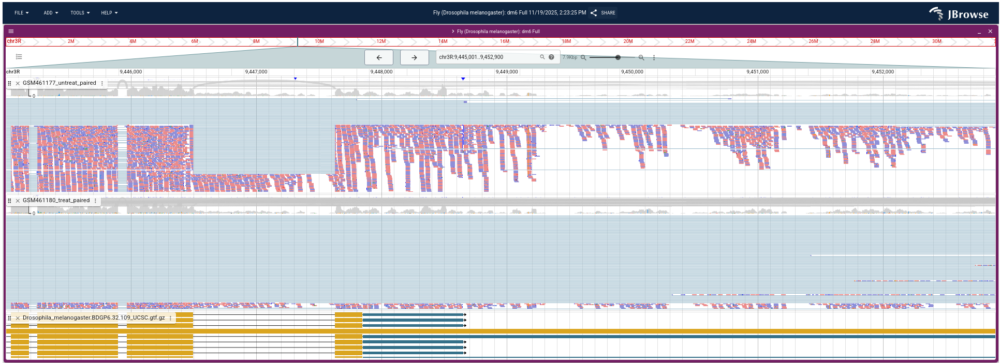
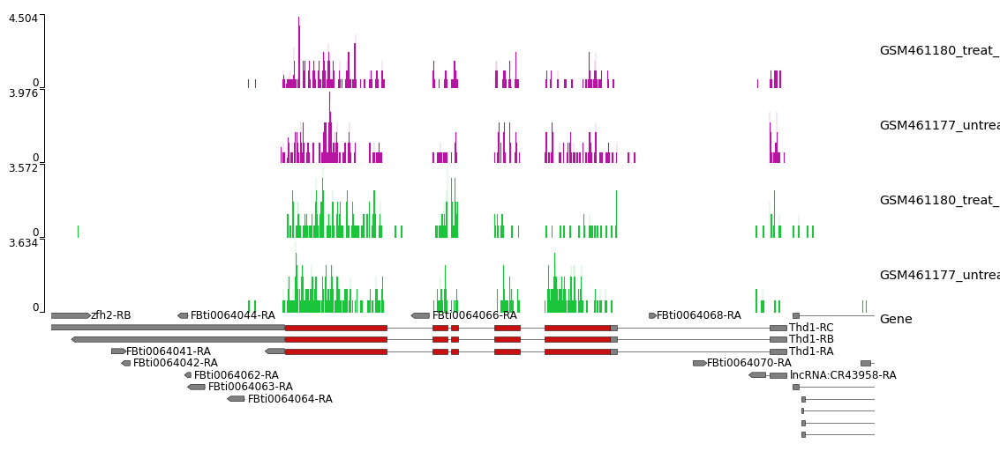

# Step 03: Strandness Estimation and Read Counting

## Objective
Determine the strandness of the RNA-seq library using multiple 
complementary methods, then quantify the number of reads mapping 
to each annotated gene using featureCounts with the confirmed 
strandness setting.

---

## Biological Context

### Why Strandness Matters
RNA-seq reads originate from single-stranded mRNA molecules that 
have directionality (5' to 3'). During library preparation, this 
strand information may or may not be preserved depending on the 
protocol used. Knowing the library strandness is critical for:
- Correctly assigning reads to genes that overlap on opposite strands
- Setting the correct parameter in featureCounts
- Avoiding miscounting of ambiguous reads

### Why Read Counting
To identify differentially expressed genes, we must first quantify 
how many reads map to each gene in each sample. featureCounts 
assigns aligned reads to genomic features (exons) defined in the 
GTF annotation file and produces a count table used as input for 
DESeq2.

---

## Tools Used

| Tool | Version | Purpose |
|---|---|---|
| IGV | Desktop | Visual strandness inspection |
| JBrowse2 | 3.6.5+galaxy1 | Visual strandness inspection |
| pyGenomeTracks | 3.9+galaxy0 | Strand-specific coverage visualization |
| MultiQC | 1.27+galaxy4 | STAR gene count strandness aggregation |
| featureCounts | 2.1.1+galaxy0 | Read counting per annotated gene |

---

## Part 1: Strandness Estimation

Four complementary methods were used to determine library strandness.
All four methods confirmed the library is **unstranded**.

---

### Method 1 — IGV Visual Inspection

**Region:** `chr3R:9,445,000-9,448,000` (Pasilla gene locus)

**Steps performed:**
- Loaded `GSM461177_untreat_paired` BAM in IGV
- Navigated to `chr3R:9,445,000-9,448,000`
- Right-clicked BAM track → Color Alignments by → First-of-pair strand
- Right-clicked → Squished

**Observations:**
- Red reads (forward strand) and blue reads (reverse strand) are 
  evenly and randomly mixed throughout the ps gene region
- No strand dominance observed
- **Conclusion: Unstranded library**

---

### Method 2 — JBrowse2 Visual Inspection

**Region:** `chr3R:9,445,000-9,448,000` (Pasilla gene locus)

**Steps performed:**
- Opened JBrowse2 result in Galaxy
- Navigated to `chr3R:9445000..9448000`
- For each BAM track: 3 dots → Pileup settings → Color by → 
  First-of-pair strand
- For each BAM track: 3 dots → Pileup settings → Set feature 
  height → Compact

**Observations:**
- Both `GSM461177_untreat_paired` and `GSM461180_treat_paired` 
  show even mixing of red and blue reads
- Gene annotation track confirms this is the Pasilla (ps) gene locus
- **Conclusion: Unstranded library**

---

### Method 3 — pyGenomeTracks Strand Coverage

**Region:** `chr4:540,000-560,000`

**Parameters:**

| Parameter | Value |
|---|---|
| Region | chr4:540,000-560,000 |
| Track 1 | RNA STAR Coverage Uniquely mapped strand 1 (purple) |
| Track 2 | RNA STAR Coverage Uniquely mapped strand 2 (green) |
| Track 3 | Gene track from GTF file |
| Height | 3 per bedgraph track, 5 for gene track |

**Observations:**
- Purple tracks (Strand 1) and green tracks (Strand 2) show 
  comparable coverage levels across chr4 for both samples
- Both strands are represented equally at gene loci including 
  `zfh2`, `Thd1`, `FBti0064066-RA`, and `lncRNA:CR43958`
- **Conclusion: Unstranded library**

---

### Method 4 — MultiQC on STAR Gene Counts

**Parameters:**

| Parameter | Value |
|---|---|
| Which tool | STAR |
| Type of STAR output | Gene counts |
| STAR gene count output | RNA STAR on collection N: reads per gene |

**Observations:**
- STAR evaluates read counts under three scenarios: unstranded, 
  stranded forward, and stranded reverse
- The unstranded column shows the highest and most consistent 
  read assignment across both samples
- **Conclusion: Unstranded library**

> **Note:** Infer Experiment (RSeQC) was attempted but skipped 
> due to a Galaxy server-side error in the Convert GTF to BED12 
> tool (Exit code 255 — bad line format). Strandness was 
> confirmed unstranded by the four methods above.

---

### Strandness Summary

| Method | Result |
|---|---|
| IGV visual inspection | Unstranded |
| JBrowse2 visual inspection | Unstranded |
| pyGenomeTracks strand coverage | Unstranded |
| MultiQC STAR gene counts | Unstranded |
| **Final conclusion** | **Unstranded library** |

---

## Part 2: Read Counting with featureCounts

### Why featureCounts
featureCounts assigns mapped reads to genomic features defined 
in the GTF annotation. It offers more flexibility than HTSeq-count, 
including minimum mapping quality filtering and paired-end fragment 
counting. The output count table is directly compatible with DESeq2.

### Parameters

| Parameter | Value |
|---|---|
| Alignment file | RNA STAR on collection N: mapped.bam |
| Strand information | Unstranded |
| Gene annotation file | Drosophila_melanogaster.BDGP6.32.109_UCSC.gtf.gz |
| GFF feature type filter | exon |
| GFF gene identifier | gene_id |
| Output format | Gene-ID tab read-count (DESeq2 compatible) |
| Create gene-length file | Yes |
| Input has read pairs | Yes, paired-end — count as 1 fragment |
| Minimum mapping quality | 10 |

### MultiQC on featureCounts

**Parameters:**

| Parameter | Value |
|---|---|
| Which tool | featureCounts |
| Output of FeatureCounts | featureCounts on collection N: Summary |

### Outputs Generated

| Output | Description |
|---|---|
| `featureCounts on collection N: Counts` | Read counts per gene per sample |
| `featureCounts on collection N: Feature lengths` | Gene lengths (needed for GOseq later) |
| `featureCounts on collection N: Summary` | Assignment statistics |

### Results

| Metric | GSM461177 (Untreated) | GSM461180 (Treated) |
|---|---|---|
| Reads assigned to genes | reported in MultiQC | reported in MultiQC |
| Unassigned (unmapped) | remainder | remainder |
| Unassigned (multimapping) | remainder | remainder |

> Assignment rates below 50% would require investigation. 
> Rates above 60% are generally acceptable for downstream 
> differential expression analysis.

---

## Key Conclusions

| Finding | Conclusion |
|---|---|
| All 4 strandness methods agree | Library is unstranded |
| Unstranded confirmed before featureCounts | Correct parameter set |
| featureCounts completed successfully | Count table ready for DESeq2 |
| Gene-length file generated | Available for GOseq enrichment analysis |

---

## Reproducibility Notes

- Galaxy History: `RNA-seq-Pasilla-Analysis`
- pyGenomeTracks version: 3.9+galaxy0
- featureCounts version: 2.1.1+galaxy0
- MultiQC version: 1.27+galaxy4
- Reference genome: dm6
- Annotation: Drosophila_melanogaster.BDGP6.32.109_UCSC.gtf.gz
- Strandness setting used in featureCounts: Unstranded
- Zenodo source: https://zenodo.org/record/6457007

