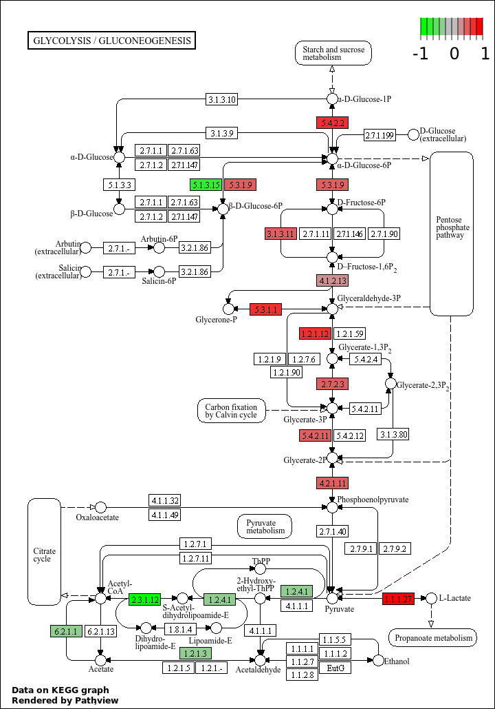
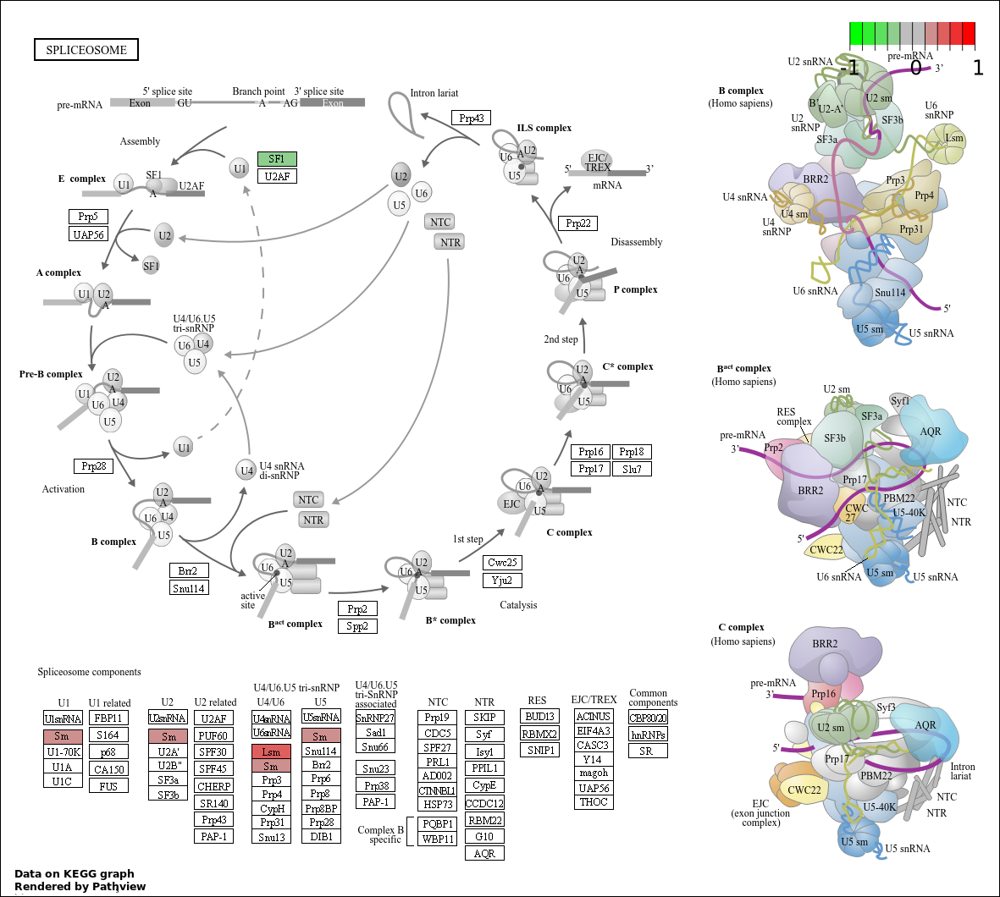

# Step 05: Functional Enrichment Analysis — GO and KEGG Pathways

## Objective
Identify biological functions, processes, and pathways that are 
significantly enriched among the 113 differentially expressed genes 
identified in Step 04, using Gene Ontology (GO) analysis and KEGG 
pathway analysis via goseq, while correcting for gene length bias 
inherent to RNA-seq data.

---

## Biological Context

Standard GO enrichment methods give biased results on RNA-seq data 
because longer and more highly expressed genes are more likely to be 
detected as differentially expressed regardless of biological relevance. 
goseq corrects for this length bias using the Wallenius non-central 
hypergeometric distribution, making it the appropriate tool for 
RNA-seq functional enrichment analysis.

Two categories of functional annotation were investigated:

- **Gene Ontology (GO)** — classifies genes into Biological Process 
  (BP), Molecular Function (MF), and Cellular Component (CC) terms
- **KEGG Pathways** — maps genes onto curated molecular interaction 
  and metabolic pathway diagrams

---

## Tools Used

| Tool | Version | Purpose |
|---|---|---|
| Compute | 2.1 | Add DE boolean column to DESeq2 results |
| Cut columns | Galaxy built-in | Extract relevant columns |
| Change Case | Galaxy built-in | Convert gene IDs to uppercase |
| Extract Dataset | Galaxy built-in | Extract gene length file |
| goseq | 1.50.0+galaxy0 | GO and KEGG enrichment analysis |
| Pathview | 1.34.0+galaxy0 | KEGG pathway visualization with log2FC overlay |

---

## Part 1: Prepare Input Files for goseq

goseq requires two input files:
1. A two-column tabular file with gene IDs and a True/False 
   differential expression indicator
2. A gene length file to correct for length bias

### 1A — Prepare DE gene indicator file

**Step 1 — Compute boolean DE column:**

| Parameter | Value |
|---|---|
| Input file | DESeq2 result file |
| Add expression | `bool(float(c7)<0.05)` |
| Mode | Append |
| Autodetect column types | No |
| If expression cannot be computed | Fill with replacement value: `False` |

**Step 2 — Cut columns:**

| Parameter | Value |
|---|---|
| Cut columns | `c1,c8` |
| Delimited by | Tab |
| From | Output of Compute tool |

**Step 3 — Change case to uppercase:**

| Parameter | Value |
|---|---|
| Change case of columns | c1 |
| To | Upper case |

Output renamed to: `Gene IDs and differential expression`

---

### 1B — Prepare gene length file

The featureCounts Feature lengths collection was copied from the 
previous history (`RNA-seq-Pasilla-Analysis`) into the current 
history (`RNA-seq-Pasilla-DESeq2`).

**Extract Dataset:**

| Parameter | Value |
|---|---|
| Input List | featureCounts on collection N: Feature lengths |
| How to select | The first dataset |

**Change Case:**

| Parameter | Value |
|---|---|
| From | GSM461177_untreat_paired (output of Extract Dataset) |
| Change case of columns | c1 |
| To | Upper case |

Output renamed to: `Gene IDs and length`

---

## Part 2: GO Enrichment Analysis

### Parameters

| Parameter | Value |
|---|---|
| Differentially expressed genes file | Gene IDs and differential expression |
| Gene lengths file | Gene IDs and length |
| Gene categories | Get categories |
| Select a genome | Fruit fly (dm6) |
| Select Gene ID format | Ensembl Gene ID |
| Select categories | GO: Cellular Component, GO: Biological Process, GO: Molecular Function |
| Output Top GO terms plot | Yes |
| Extract DE genes for categories | Yes |

### Outputs

| Output | Saved as |
|---|---|
| Ranked GO category list (Wallenius method) | `data/goseq_GO_results.tabular` |
| Top 10 over-represented GO terms plot | `data/goseq_GO_top10_terms.pdf` |
| DE genes per GO category | `data/goseq_GO_DE_genes_per_category.tabular` |

### Results & Interpretation

The GO results table contains the following columns for each term:

| Column | Description |
|---|---|
| category | GO term ID |
| over_rep_pval | p-value for over-representation |
| under_rep_pval | p-value for under-representation |
| numDEInCat | Number of DE genes in this category |
| numInCat | Total genes in this category |
| term | GO term description |
| ontology | BP, MF, or CC |
| p.adjust.over_represented | BH-adjusted p-value for over-representation |
| p.adjust.under_represented | BH-adjusted p-value for under-representation |

**Key observations:**
- The top over-represented GO terms are visualized in 
  `data/goseq_GO_top10_terms.pdf`
- The x-axis of the top GO terms plot shows the number of 
  DE genes in each category (numDEInCat), giving a direct 
  measure of how many of the 113 DE genes belong to each term
- Significance is assessed using the BH-adjusted p-value 
  (p.adjust.over_represented < 0.05)
- GO terms related to RNA binding, splicing, and 
  nucleotide processing are expected to be enriched given 
  that Pasilla is a splicing regulator

---

## Part 3: KEGG Pathway Analysis

### Parameters

| Parameter | Value |
|---|---|
| Differentially expressed genes file | Gene IDs and differential expression |
| Gene lengths file | Gene IDs and length |
| Gene categories | Get categories |
| Select a genome | Fruit fly (dm6) |
| Select Gene ID format | Ensembl Gene ID |
| Select categories | KEGG |
| Output Top GO terms plot | No |
| Extract DE genes for categories | Yes |

### Outputs

| Output | Saved as |
|---|---|
| KEGG pathway ranked list | `data/goseq_KEGG_results.tabular` |
| DE genes per KEGG pathway | `data/goseq_KEGG_DE_genes_per_pathway.tabular` |

### Results & Interpretation

- The KEGG results table lists all identified Drosophila KEGG 
  pathway terms with over- and under-representation statistics
- Over-represented pathway: **dme00010 — Glycolysis/Gluconeogenesis**
- Most under-represented pathway (not significantly): 
  **dme03040 — Spliceosome**
- The spliceosome pathway being under-represented is biologically 
  meaningful — Pasilla is a splicing regulator, and its depletion 
  is expected to affect spliceosome-associated gene expression

---

## Part 4: KEGG Pathway Visualization with Pathview

To visualize gene-level log2 fold changes overlaid on KEGG pathway 
diagrams, two preparatory steps were performed first.

### 4A — Extract gene IDs and log2FC

**Cut columns from `Genes with significant adj p-value`:**

| Parameter | Value |
|---|---|
| Cut columns | `c1,c3` |
| Delimited by | Tab |
| From | Genes with significant adj p-value |

Output renamed to: `Genes with significant adj p-value and their Log2 FC`

### 4B — Create pathway ID file

A new tabular file named `KEGG pathways to plot` was created 
containing:
00010
03040

### 4C — Run Pathview

| Parameter | Value |
|---|---|
| Number of pathways to plot | Multiple |
| KEGG pathways | KEGG pathways to plot |
| File has header | No |
| Species | Fly |
| Provide gene data file | Yes |
| Gene data | Genes with significant adj p-value and their Log2 FC |
| Gene data has header | Yes |
| Format for gene data | Ensembl Gene ID |
| Provide compound data | No |
| Output for pathway | KEGG native |
| Plot on same layer | Yes |

### Outputs

**Glycolysis / Gluconeogenesis Pathway (dme00010)**

**Spliceosome Pathway (dme03040)**

### Interpretation

- Each colored box in the Pathview output represents a gene 
  in the pathway
- **Color code:** Red boxes indicate upregulated genes 
  (positive log2FC in treated vs untreated), green boxes 
  indicate downregulated genes (negative log2FC), grey boxes 
  indicate genes not in the DE list
- The Glycolysis pathway (dme00010) shows colored nodes 
  confirming that several metabolic genes are differentially 
  expressed upon Pasilla depletion
- The Spliceosome pathway (dme03040) visualization confirms 
  the biological relevance of Pasilla as a splicing regulator, 
  with multiple spliceosome components showing altered expression

---

## Key Conclusions

| Finding | Conclusion |
|---|---|
| GO terms enriched in RNA binding and splicing | Consistent with Pasilla being a splicing regulator |
| Glycolysis pathway over-represented | Pasilla depletion affects metabolic gene expression |
| Spliceosome pathway under-represented | Splicing machinery genes show reduced DE upon PS loss |
| Length bias corrected by goseq | Enrichment results are reliable for RNA-seq data |
| Pathview confirms gene-level FC on pathways | Results are biologically interpretable at pathway level |

---

## Reproducibility Notes

- Galaxy History: `RNA-seq-Pasilla-DESeq2`
- goseq version: 1.50.0+galaxy0
- Pathview version: 1.34.0+galaxy0
- Reference genome: dm6 (Drosophila melanogaster)
- Gene ID format: Ensembl Gene ID
- Length bias correction method: Wallenius non-central 
  hypergeometric distribution
- Significance threshold: BH-adjusted p-value < 0.05
- DE gene input: 113 genes (adj p-value < 0.05, abs log2FC > 1)
- Zenodo source: https://zenodo.org/record/6457007

